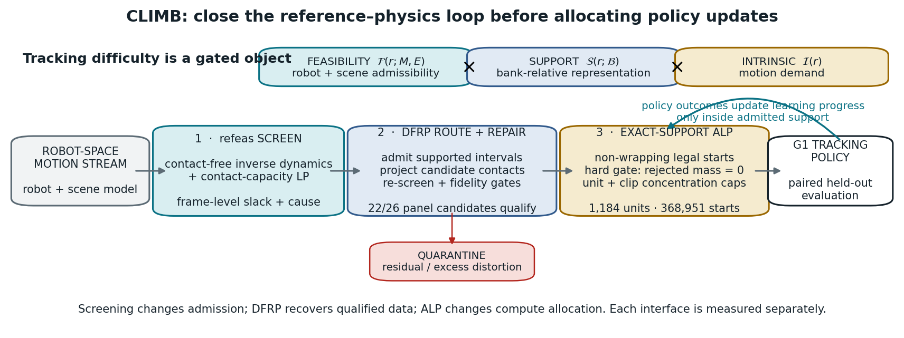

# Feasibility First: Auditing Reference Dynamics Before Adaptive Humanoid Motion Tracking

**Manuscript status:** unsealed ICRA-sized prose draft, 2026-09-04. The anonymous two-column source
is `paper/icra/root.tex`, its verified bibliography is `paper/icra/references.bib`, and a passing
build writes `paper/icra/ICRA_DRAFT.pdf`. Bracketed Phase-G text is deliberately pending. This
draft does not report an unrun experiment or authorize endpoint access. Claims and numbers remain
governed by `paper/RESULTS_LOG.md` and the sealed records it cites.

## Abstract

Failure-adaptive sampling is intended to concentrate humanoid tracking updates on motions the
policy has not mastered. Policy error, however, can conflate controllable difficulty with a
reference that demands unsupported or over-limit robot dynamics. In a three-seed Unitree G1
campaign, a failure-adaptive sampler's peak top-1 mass reached 87--89%, and the same
kneel-and-crawl reference became a dominant attractor in every seed; during that reference's
descent, 86% of frames have no collision geometry within 6 cm of the floor, and median unsupported
force is approximately one body weight. We introduce a
policy-independent screen that applies contact-free inverse dynamics and a torque-limited contact
program to the final robot-space trajectory before training. On one AMASS-to-G1 pipeline, the
screen flags 2,442 of 10,705 clips above a fixed 10%-of-frames threshold; on a separate filtered
4,950-clip production pairing, an independent implementation flags 7, and the implementations
agree on 39 of 40 strict decisions in a stratified same-clip panel. We then convert feasible
intervals into 1,184 hash-bound attribution units with 368,951 legal fixed-horizon starts, enabling
a controlled comparison of learning-progress and deployment-uniform allocation on identical
support. **[Phase G pending: replace with exactly one positive, null, inconclusive, or
`not_tested` sentence containing the primary estimate and interval.]** The present evidence
supports an embodiment- and pipeline-specific release audit, not a generic prevalence rate, a
hardware-safety certificate, or a claim that filtering improves policy performance.

## 1. Introduction

Large retargeted motion banks have made generalist humanoid tracking a practical training recipe:
map human motion to a robot, train a policy over the resulting references in massively parallel
simulation, and spend additional updates on motions the policy currently fails. Systems such as
PHC, MaskedMimic, H2O, ExBody, BeyondMimic, and SONIC demonstrate the scale and capability of this
recipe [1--6]. Adaptive motion allocation is a natural part of it. Failure, completion, or recent
learning progress appears to tell the trainer where another update is most useful [5,7,8].

That interpretation assumes that policy error measures a solvable control problem. A retargeted
trajectory can violate the assumption before the policy acts. The robot may have no admissible
contact capable of supplying the demanded base wrench, or the contact forces that would supply it
may require joint effort outside the modeled actuator range. The same policy failure then admits
two incompatible readings: the controller has not yet learned a feasible skill, or the reference
does not define a feasible skill for this embodiment and scene. Sampling more of the first case may
be useful; sampling more of the second cannot establish the value of an allocation rule.

We observed this ambiguity in a 100-motion Unitree G1 campaign. A BeyondMimic-style failure
sampler concentrated on the same kneel-and-crawl clip in all three seeds. Peak top-1 mass was
0.884, 0.870, and 0.893; those maxima describe whichever clip led at that instant and belonged to
another clip in two seeds. Clip-uniform sampling nevertheless achieved higher held-out survival in
all three paired seeds. The shared attractor passes ordinary kinematic checks. Yet, from 0.75 to 1.75 s,
its pelvis descends from 0.79 to 0.40 m while the nearest collision geometry remains 7--10 cm above
the floor. A median 329 N of support demand, approximately the 327 N model weight, has no modeled
source. The sampler therefore reads a persistent reference defect as persistent learning value.

Three ambiguities have to be removed before testing adaptive allocation. First, **error
ambiguity** mixes policy competence with reference feasibility. Second, **support ambiguity**
arises when clip-level sampling changes the prior over duration and admits fixed-horizon starts
that cross invalid frames. Third, **evaluation ambiguity** arises when wraparound, implicit
teleports, reset-state terminal reads, or unstable attribution make unlike trials appear paired.
These are experimental-interface problems, not merely data-cleaning details.

Our interface has two parts. A robot-space dynamic-feasibility screen analyzes the final
retargeted trajectory using the target MuJoCo model, modeled contact geometry, friction, and
actuator ranges. It reports unsupported wrench and related diagnostics without training a policy.
An exact-support contract then turns feasible intervals into non-wrapping fixed-horizon starts,
stable attribution units, and paired evaluation conditions whose identities are bound by content
hashes. This contract lets the allocation rule change while embodiment, reward, PPO, support,
legal-start prior, caps, compute, seeds, and evaluator remain fixed.

The resulting evidence has an important boundary. The screen flags 2,442/10,705 clips in the
primary AMASS-to-`whole_body_tracking`-to-G1 pipeline, but only 7/4,950 in the separately filtered
BONES-SEED-to-G1 production pairing used by SONIC. The two implementations agree on 39/40 strict
decisions in a stratified same-clip panel. Thus the large prevalence difference is not licensed as
a retargeter comparison: source corpus, release filtering, robot file, and implementation also
change. It instead shows why feasibility prevalence must be measured for each corpus-and-pipeline
pairing and why the audit is useful as a release gate rather than as a universal rejection rule.

This paper makes three contributions:

1. **A measured failure diagnosis and policy-independent screen.** We trace a reproducible
   sampler attractor to an unsupported reference interval and screen the final robot-space
   trajectory using modeled contacts and actuator limits.
2. **An exact-support trial contract.** Feasible intervals, full-horizon legal starts, stable
   units, explicit terminals, paired conditions, and hashes yield 1,184 training units with
   368,951 legal starts and a disjoint 100-clip evaluation panel.
3. **A controlled allocation test.** We predeclare a manipulation-first comparison of calibrated
   absolute-learning-progress allocation against deployment-uniform allocation on identical
   support. A failed manipulation or provenance gate produces `not_tested`; it does not expose a
   policy endpoint.

The third contribution remains a protocol until Phase G completes. This distinction is central:
the current measured contributions do not require an adaptive-policy win, and a valid null would
recommend the simpler allocator within the tested task rather than weaken the screen.

## 2. Related work

### Motion filtering and dynamic retargeting

Policy-based curation already removes poorly tracked references. H2O retains AMASS motions that a
privileged imitator can follow, and ExBody2 uses an initial policy's sequence errors to select a
feasible and diverse subset [3,9]. These are effective system designs, but their score requires a
trained policy and combines reference quality with that policy's capability. KungfuBot instead
uses a human-space center-of-mass/center-of-pressure stability heuristic before robot retargeting
[10]. LIMMT combines target-robot motion heuristics, diversity, and complexity, with physical-score
weights calibrated through repeated policy training [11]. PHUMA filters source artifacts and
retargets with joint-limit, ground-contact, and anti-skating losses [12]. These works rule out
claims that filtering or physics-aware curation is itself new.

Optimization-based retargeters address a complementary problem. Kinodynamic Motion Retargeting
uses rigid-body and contact constraints to construct viable locomotion, while Direct Dynamic
Retargeting uses simulator-in-the-loop optimization without requiring an infeasible geometric
intermediate [13,14]. AMO and SPIDER likewise generate viable references through trajectory
optimization or physics-based sampling with contact guidance [15,16]. GMR and *Retargeting
Matters* further show that retargeting artifacts affect downstream tracking robustness [17]. An
earlier analytic study estimates velocity, acceleration, and torque requirements for 40 upper-body
motions, but does not test whole-body environmental support [18]. Repair can therefore be
preferable to exclusion. Our narrower question is diagnostic and routing-oriented: after
retargeting, can the demanded robot-space wrench be supplied by admissible contacts within the
modeled actuator limits? The screen can route a reference toward exclusion, repair, or a
scene/contact-model correction; it does not decide that exclusion is best.

### Adaptive allocation

Prioritized experience replay and prioritized level replay formalize the benefit and bias of
nonuniform training distributions, including explicit replay/exploration mixing [19,20]. In
humanoid tracking, BeyondMimic popularized a failure-EMA bin sampler, while GMT and EGM reweight
motions or motion segments using tracking outcomes [5,7,8]. Those systems combine allocation with
curation, staged training, clipping, or architectural changes. Their results motivate the present
test but do not isolate one learning-progress allocator after feasible support and the legal-start
prior are held exact. Our comparison changes only the allocation distribution over a shared set of
legal trials.

### Evaluation on fixed support

Robot-learning comparisons are sensitive to seed count, aggregation, and interval construction
[21]. Tracking adds another conditioning problem: kinematic error among survivors can improve when
a method terminates earlier. HumanTracker responds to related limitations by adding contact-aware
and preference-aligned trajectory diagnostics [22]. We use a liveness-weighted tracking score as
the primary Phase-G endpoint and report common-survivor quality only beside survival. The current
contact-timing proxy remains exploratory unless it passes an independent blinded-label gate.

## 3. Dynamic-feasibility and exact-support interface

### 3.1 Problem and assumptions

Let a retargeted reference provide generalized position and velocity
`(q_t, qdot_t)` for the Unitree G1 at frame `t`. We apply a centered five-frame moving average to
velocity, differentiate at the reference frame rate, and smooth the resulting acceleration with
the same window. The audit is conditioned on a specific robot model, flat plane, collision geometry,
friction model, actuator force ranges, and reference trajectory. Its output is therefore a verdict
about that robot/reference/scene tuple. It is not a certificate for unmodeled electrical,
thermal, compliance, latency, or hardware-safety constraints.

We use the compiled G1 MuJoCo model that underlies the tracking environment. Contact-free inverse
dynamics returns the generalized force needed to realize the prescribed acceleration. The six
free-joint coordinates define the base wrench `W_t` that the environment must supply; the remaining
coordinates define contact-free joint torque `tau_free,t`. A collision geometry becomes a
candidate contact when its exact distance to the plane is at most `g = 0.06 m`.

The 6 cm band is a declared engineering tolerance. At 3 cm a known feasible control is flagged on
42% of frames because the bank carries an approximately 3 cm ground-alignment offset. At 10 cm,
the attractor's 7--10 cm floating descent is incorrectly granted a contact candidate and reads as
feasible. The 6 cm setting lies between those observed failure modes; it is not presented as a
universal physical constant.

### 3.2 Contact-capacity screen

For each candidate contact point we construct a four-edge pyramidal friction cone with coefficient
0.6 in the primary model; a simulator-matched secondary view makes non-foot contacts frictionless.
Mapping a
nonnegative vector of generator magnitudes `f_t` through the contact Jacobian gives both a base
wrench matrix `A_t f_t` and a joint-torque contribution `J_t f_t`. We first solve a weighted
nonnegative least-squares problem to expose the unconstrained residual, weighting angular-wrench
rows by two so forces and moments are comparable at an approximately 0.5 m lever arm. We then solve a linear
program that minimizes the L1 wrench slack while enforcing

`-tau_max <= tau_free,t - J_t f_t <= tau_max,   f_t >= 0`.

The translational component of the resulting weighted residual defines unsupported force under
these modeled contacts and actuator limits. With no candidate contact, the residual is the
contact-free demand.
We report four clip-level quantities: the fraction of frames with no contact candidate
(`airborne_frac`), the fraction whose torque-limited unsupported force exceeds half the robot
weight (`infeasible_frac`), the time integral of unsupported force normalized by weight, and the
fraction for which joint-torque feasibility itself fails. A clip crosses the primary audit rule
only when `infeasible_frac > 0.10` (strict inequality).

Airborne and infeasible are intentionally separate. A ballistic flight phase with acceleration
near gravity has little external support demand and is not flagged merely because no geometry is
near the floor. Conversely, nonballistic hovering or descending without an admissible support
source is flagged. In the second production bank, seven kneeling loops are airborne on every frame
yet have zero infeasible fraction because the modeled knees can supply support. Collapsing the two
axes would delete precisely the non-foot-contact behavior a rare-skill bank should preserve.

The screen takes approximately one CPU-second per clip in the primary implementation. A separate
implementation screens the 4,950-clip production bank at 0.145 CPU-s per clip (0.84 ms per screened
frame). These costs support corpus-scale audit; they do not imply real-time control use.

### 3.3 Exact-support trials

Clip classification alone is too coarse for a controlled allocation experiment. A clip can
contain both supportable and unsupported intervals. We therefore reduce full per-frame screens to
ordered feasible runs, retain only 50-step windows that lie wholly inside a run, and bind each
motion and sidecar by SHA-256. The table spans 800 training clips and contains 1,841 source units.
After discarding 657 runs shorter than the fixed horizon, 1,184 admissible units and 368,951 legal
starts remain. A unit is an attribution stratum; the deployment prior is uniform over legal starts,
not uniform over units or clips.

The runtime samples only legal starts, emits an explicit truncation at a segment boundary, and
attributes attempts and outcomes to the sampled unit. It never wraps into a rejected frame or
continues learning across a reference teleport. The sampler owns a deterministic CPU generator and
serializes its state and sufficient statistics for equivalent resume. Per-unit and per-clip caps
bound concentration. A missing sidecar, changed motion hash, invalid start, invalid reference
frame, or censored reset fails the contract.

The paired evaluator freezes `(motion, start, replicate, environment noise, dynamics noise)` and
replays it across policies. It assigns the reference before computing the first observation,
disables auto-reset until terminal channels are captured, rejects rather than clips invalid
offsets, and records checkpoint, task, conditions, reference, evaluator, and output hashes. The
100-clip panel is name- and hash-disjoint from the 800 training clips and contains 2,800 paired
conditions.

## 4. Experimental design

### RQ1: Does the motivating failure occur?

We analyze the previously sealed 100-motion campaign: 4,096 environments, 4,000 PPO iterations,
three seeds per arm, and 100 disjoint evaluation motions with eight episodes per clip. The
comparison includes failure-adaptive, clip-uniform, and a normalized grounded sampler. We report
the adaptive top-1 exposure, the identity of its attractor, and held-out survival. This campaign
motivates the audit; it is not reused as evidence for the new exact-support allocation claim.

### RQ2: What does the screen measure at bank scale?

The primary corpus contains 10,705 AMASS-derived references retargeted through
`whole_body_tracking` to the G1 model. We report raw flagged counts under the strict fixed rule,
category and source breakdowns, and contamination in the historical 100-clip evaluator. A separate
experiment covers all 4,950 references in the filtered BONES-SEED production pairing. We never pool
their prevalence estimates. A deterministic 40-clip stratified panel (20 from each bank) is passed
through both implementations to measure score and decision agreement; because the panel is
enriched for flags, it is not a prevalence sample.

### RQ3: Does a simpler intervention establish training benefit?

No. We retain two negative controls. E-HYG prunes 99 flagged motions from an 800-motion training
bank but yields a held-out feasible-motion effect of -0.0101 under its predeclared test. The soft
FGAS segment formulation estimates a primary effect of -0.0196 with a 95% hierarchical-bootstrap
interval `[-0.0497, +0.0134]`, but its rejected-start-mass manipulation gate fails. The exploratory
segment-native pilot is mechanically clean yet reaches only 0.014 total variation from its
control. These observations motivate an exact-support, manipulation-first test; none is evidence
that the final allocator helps.

### RQ4: Does learning-progress allocation help on identical support?

Phase G compares two 512-environment, 4,000-iteration arms with confirmation seeds 1, 2, and 3.
G1 samples uniformly over all legal starts. G2 estimates the Beta-smoothed conditional success
rate `s_u(k)` for each unit and ranks absolute learning progress
`LP_u(k) = |s_u(k) - s_u(k-10)|`. Its focus distribution is proportional to the legal-start prior
times `LP_u + lambda`; exploration `rho` mixes the G1 prior back in before the fixed unit and clip
caps.

Before sealing, a 12-row grid crosses `rho in {0.05, 0.10, 0.20, 0.40}` and
`lambda in {0.001, 0.01, 0.05}`. Every row runs for 50 iterations on seed 20260903. Only sampler
ledgers at iterations 30, 40, and 49 enter selection. A row passes when mean allocation total
variation is in `[0.05, 0.15]`, each checkpoint lies in `[0.025, 0.20]`, entropy-effective units
remain at least 12, top-1 probability remains at most 0.05, invalid/censored counts are zero, and
final rank saturation is below 0.90. The passing row nearest TV 0.10 is selected, with TV variance
and declared order as ties, then repeated once on seed 20260904. Failure returns the study to
design without opening a policy endpoint.

The confirmation gate applies the same separation, concentration, validity, parameter, seed, and
provenance checks after a 400-iteration warm-up. Only a passed gate unlocks the primary endpoint:
liveness-weighted TrackingScore on the 25 reference-defined feasible-hard evaluation clips,
`h exp(-MPKPE/0.30 m - anchor_error/0.40 rad)`, where `h` is survived-horizon fraction. The
independent unit is clip within training seed, with a seed-then-clip hierarchical bootstrap of
10,000 draws. Survival, all-panel TrackingScore, AULC, and common-survivor non-harm are declared
secondaries. Exactly one status is printed: `positive`, `null`, `inconclusive`, or `not_tested`.

## 5. Results

### 5.1 Failure-adaptive exposure can lock onto a reference defect

The adaptive sampler's peak top-1 mass is 0.884/0.870/0.893 across the three campaign seeds, and
the same BMLmovi kneel-and-crawl clip repeatedly becomes the dominant attractor in all three.
The maximum top-1 mass belongs to another clip in two seeds, so we do not attribute all three
maxima to the shared attractor. Uniform sampling achieves
higher held-out endpoint survival in every paired seed: differences `(uniform - adaptive)` are
+0.0300, +0.0275, and +0.0300. With only three seeds, the sign pattern is the useful description;
the minimum attainable paired permutation p-value is 0.125, so we do not headline a significance
claim.

The reference is kinematically ordinary: it has no joint-limit violation and peak joint speed is
at most 5.6 rad/s. The dynamic audit localizes a different failure. From 0.75--1.75 s, 86% of
frames have no candidate contact and median unsupported force is 329 N; the G1 model weighs 327 N.
The kneeling/crawling interval from 1.75--7.25 s is supportable through its non-foot contacts, and
the 8.0--8.5 s rise again becomes unsupported. Every trained policy has zero survival from frame
0, while the tested late 8 s offset survives. This explains why random-offset averaging had
previously made an untrackable prefix look partially learnable.

**Fig. 1. The feasibility-first trial interface.** (a) In the motivating closed-loop simulation
campaign, the same attractor recurs in 3/3 adaptive seeds; 0.87--0.89 is the campaign maximum
top-1 mass and does not belong to that clip in every seed. (b) A reference-only robot-space audit
localizes the attractor's unsupported interval. This pipeline-specific temporal and modeled-wrench
diagnosis does not establish that all adaptive collapse has this cause. (c) The preregistered G1/G2
comparison keeps the 1,184 units, 368,951 legal starts, hashes, PPO implementation, and compute
fixed while changing allocation. No Phase-G policy outcome is shown.

### 5.2 Infeasibility prevalence is pipeline-dependent

Under the strict `infeasible_frac > 0.10` rule, 2,442 of 10,705 primary-pipeline clips are flagged
(22.8%). Category rates range from 12.9% for quiet motion to 58.6% for dynamic motion, and source
rates range from 0.1% for GRAB to 100% for CNRS. Severity-stratified inspection shows why category
labels are insufficient: the five inspected CNRS cases are ordinary fast walks with extended
floating intervals, whereas the Transitions sample mixes ingest defects with acrobatic content.
The 22.8% is therefore a property of this corpus and pipeline, not a generic rate for retargeted
motion or an intrinsic-difficulty gradient.

The second production pairing supplies the strongest boundary. Only 7 of 4,950 clips (0.14%) cross
the same nominal strict rule, while 111 (2.24%) are airborne on more than 10% of frames. Five of the
seven flags are jumps, including four whose names refer to a 50 cm box absent from the flat audit
scene. Their verdict is “unsupported on this plane,” which routes them toward the missing terrain
or exclusion rather than geometric root projection.

Across the 40-clip same-input implementation panel, `infeasible_frac` ranks correlate at 0.9836,
`airborne_frac` at 0.9974, and strict decisions agree for 39/40 clips (Cohen's kappa 0.9485). The
single disagreement is `burpee_002__A362_M` (0.019 versus 0.136). This closes an implementation-
agreement question on the enriched panel; it does not remove the corpus, filter, robot-file, or
friction confounds between the two full-bank prevalence estimates.

**Figure 2. Bank-scale audit and implementation check.** (a) Bars are normalized within two
separate corpus/pipeline denominators and apply the strict `infeasible_frac > 0.10` rule:
2,442/10,705 for AMASS → `whole_body_tracking` → G1 and 7/4,950 for filtered BONES-SEED →
G1. Corpus, filtering, robot file, friction, and implementation differ, so this is not a causal
retargeter comparison. (b) On a flag-enriched, deterministic 20+20 same-clip panel, strict
decisions agree for 39/40 clips (Spearman ρ = 0.9836, Cohen's κ = 0.9485). That panel checks
implementation agreement; its stratified selection is not a prevalence sample.

### 5.3 Obvious interventions do not establish the allocation claim

The historical evaluator contains 29 flagged clips among 100. Across three policies, flagged
clips score 6.0--8.4 survival points below the all-clip aggregate and 8.4--11.8 below the feasible
stratum. Moreover, the grounded-minus-uniform endpoint contrast is +0.025 on feasible clips and
-0.009 on flagged clips. These data justify feasibility-stratified evaluation, but changing the
evaluation subset cannot establish a training benefit.

Training-side shortcuts also fail to answer RQ4. E-HYG's pruning contrast is a sealed null. Soft
FGAS does not satisfy its own allocation gate. The prior segment-native treatment is only 0.014 TV
from control. We retain these failures because they separate three statements often collapsed in
discussion: a reference defect can be measured; screening can change the admissible training
support; and an adaptive allocation rule can improve policy performance on that support. The first
is established here, the second is an apparatus property, and only Phase G can address the third.

### 5.4 Controlled Phase-G allocation result

**Status at this draft: pending calibration; no reward, survival, or tracking endpoint has been
opened.** The exact 900-motion local payload passes every committed identity. The 12-candidate
screen is queued behind a 14,000 MiB shared-GPU availability gate. Populate this subsection only
from the frozen Phase-G result table.

**[Table 3: all 12 calibration rows and the independent-validation row.]**

**[Table 4: confirmation manipulation/provenance gate, primary feasible-hard TrackingScore
contrast, survival, AULC, and common-survivor non-harm.]**

Use exactly one of the following result forms:

- **Positive:** “With every manipulation and provenance gate passed, G2 changed feasible-hard
  TrackingScore by `[estimate]` (95% CI `[lo, hi]`) relative to G1 across `[n]` training seeds;
  survival changed by `[estimate, CI]`, and all common-survivor non-harm margins `[passed/failed]`.”
- **Null:** “With every gate passed, the feasible-hard TrackingScore interval `[lo, hi]` did not
  clear the +0.02 smallest effect of interest; within this task and budget, calibrated ALP did not
  materially improve on deployment-uniform allocation.”
- **Inconclusive:** state the interval and the exact decision rule that remains unresolved.
- **Not tested:** name the failed manipulation or provenance gate and do not print an endpoint
  estimate.

## 6. Limitations and conclusion

The audit is conditioned on one robot and simulator model and has no hardware closed-loop
validation. It models collision contacts, friction, and actuator force limits, but not electrical,
thermal, compliance, latency, or structural constraints; “screened feasible” is not a safety
certificate. The primary prevalence estimate belongs to one AMASS-derived retargeting pipeline.
The second bank bounds that estimate's generality but is not a causal retargeter comparison. Both
full-bank screens assume a flat plane, so terrain-bearing skills require their terrain to be part
of the audit.

Finite differences and a contact-distance band introduce modeling error, and the 6 cm and
half-weight thresholds are design choices supported by local sensitivity checks rather than
universal constants. Analytic routing also does not establish that exclusion is better than
repair. The observation that would settle whether screening should exclude or repair a reference
is a same-support, same-policy comparison of certified repaired and excluded intervals with
actuator and contact consequences measured under the same trial contract.

Phase G will have only three training seeds, or two if the predeclared budget fallback is exercised,
so its uncertainty is explicitly seed- and clip-structured. Contact timing remains a kinematic
proxy unless independent blinded labels pass the held-out instrument gate. A positive allocation
result would apply only to this calibrated ALP rule, support, task, and budget; a null would support
the simpler G1 default only within the same boundary.

Within those limits, the measured conclusion is already useful. A failure-adaptive curriculum can
spend most of its exposure on a reference whose demanded dynamics have no modeled support source.
A policy-independent robot-space audit finds such intervals before training, and an exact-support
interface prevents feasibility, duration exposure, and terminal semantics from leaking into the
allocation comparison. The remaining experiment asks one narrow question on that controlled
substrate. Whether its answer is positive or null, feasibility must be measured before policy
failure is interpreted as learning value.

## References — numbered mirror

Canonical verified metadata now lives in `paper/icra/references.bib`; this compact list preserves
the prose draft's numeric citation mapping. Source checks are recorded in
`paper/CITATION_CHECK_2026-08-26.md` and `paper/CITATION_CHECK_2026-09-04.md`.

1. Luo et al., “PHC,” ICCV 2023.
2. Tessler et al., “MaskedMimic,” SIGGRAPH Asia 2024.
3. He et al., “H2O,” arXiv:2403.04436.
4. Cheng et al., “ExBody,” RSS 2024, arXiv:2402.16796.
5. Liao et al., “BeyondMimic,” arXiv:2508.08241.
6. NVIDIA GEAR, “SONIC,” arXiv:2511.07820 / Science Robotics 2026.
7. Chen et al., “GMT,” arXiv:2506.14770.
8. Yang et al., “EGM,” arXiv:2512.19043.
9. “ExBody2,” arXiv:2412.13196.
10. Xie et al., “KungfuBot / PBHC,” NeurIPS 2025.
11. “LIMMT,” arXiv:2606.06953.
12. Lee et al., “PHUMA,” arXiv:2510.26236.
13. “Kinodynamic Motion Retargeting,” arXiv:2603.09956.
14. “Direct Dynamic Retargeting,” arXiv:2605.23762.
15. Li et al., “AMO,” RSS 2025.
16. Pan et al., “SPIDER,” arXiv:2511.09484.
17. “Retargeting Matters / GMR,” arXiv:2510.02252.
18. Klas et al., “On the Actuator Requirements for Human-Like Execution of Retargeted Human
    Motion on Humanoid Robots,” Humanoids 2023.
19. Schaul et al., “Prioritized Experience Replay,” ICLR 2016, arXiv:1511.05952.
20. Jiang, Grefenstette, and Rocktaschel, “Prioritized Level Replay,” ICML 2021,
    arXiv:2010.03934.
21. Agarwal et al., “Deep Reinforcement Learning at the Edge of the Statistical Precipice,”
    NeurIPS 2021, arXiv:2108.13264.
22. “HumanTracker,” arXiv:2608.13555.
