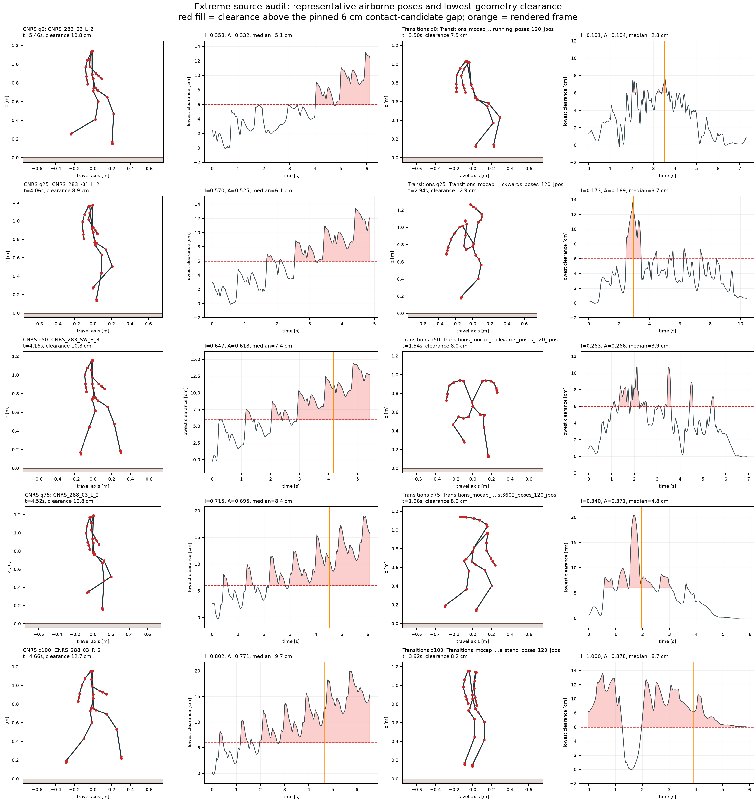

# Extreme-source hand audit — CNRS and Transitions (expanded 2026-08-26)

*Status: measured reviewer check. The 2026-08-20 audit of three CNRS clips and one Transitions
clip is superseded in sample size by this deterministic 5+5 inspection. Selection, geometry
traces, verdicts, source hashes, pinned-model hash, script hash, and completion sentinel:
`reports/feasibility_extremes/`. Screen values come from
`reports/feasibility_all/feasibility.csv`; clearance is recomputed from the raw NPZ poses under
`refeas/examples/g1_flat.xml` (sha `3e1630b4…`).*

## Selection and inspection protocol

Within each source, sort strict-flagged clips (`infeasible_frac > 0.10`) by native screen severity
and take the 0/25/50/75/100 % positions. This yields five of 79 CNRS flags and five of 95
Transitions flags without selecting on the visual verdict. For every clip, recompute the lowest
collision-geometry distance to the plane on all frames, identify the longest run above the pinned
6 cm contact gap, render its midpoint from the stored body positions, and inspect the pose and
full clearance trace. Verdict vocabulary is fixed to **ingest**, **content**, or
**scene-mismatch**.

*Panel [measured]: five severity rows per source. Red fill marks frames whose lowest collision
geometry is more than 6 cm above the plane; orange marks the rendered frame. Script:
`tools/audit_extreme_sources.py`; data: `reports/feasibility_extremes/{clips.csv,clearance_trace.csv}`.*

## Per-clip verdicts

| source | severity q | clip | screen infeasible / airborne | median clearance | longest >6 cm run | verdict |
|---|---:|---|---:|---:|---:|---|
| CNRS | 0 | `CNRS_283_03_L_2` | 0.358 / 0.332 | 5.1 cm | 1.34 s | ingest — ordinary fast walk; late root-height drift |
| CNRS | 25 | `CNRS_283_-01_L_2` | 0.570 / 0.525 | 6.1 cm | 1.60 s | ingest — ordinary fast walk; floating final segment |
| CNRS | 50 | `CNRS_283_SW_B_3` | 0.647 / 0.618 | 7.4 cm | 2.52 s | ingest — ordinary walk; whole-reference clearance drift |
| CNRS | 75 | `CNRS_288_03_L_2` | 0.715 / 0.695 | 8.4 cm | 3.14 s | ingest — ordinary fast walk; continuous floating tail |
| CNRS | 100 | `CNRS_288_03_R_2` | 0.802 / 0.771 | 9.7 cm | 3.76 s | ingest — ordinary fast walk; continuous floating tail |
| Transitions | 0 | `Transitions_mocap_mazen_c3d_walksideways_running_poses_120_jpos` | 0.101 / 0.104 | 2.8 cm | 0.22 s | ingest — ordinary running; brief floating spikes |
| Transitions | 25 | `Transitions_mocap_mazen_c3d_airkick_walkbackwards_poses_120_jpos` | 0.173 / 0.169 | 3.7 cm | 1.00 s | content — the named air-kick is visible |
| Transitions | 50 | `Transitions_mocap_mazen_c3d_walksideways_runbackwards_poses_120_jpos` | 0.263 / 0.266 | 3.9 cm | 0.46 s | ingest — ordinary locomotion; repeated floating spikes |
| Transitions | 75 | `Transitions_mocap_mazen_c3d_turntwist_jumpingtwist3602_poses_120_jpos` | 0.340 / 0.371 | 4.8 cm | 0.94 s | content — named jump/twist; peak clearance 20.4 cm |
| Transitions | 100 | `Transitions_mocap_mazen_c3d_punchkarate_stand_poses_120_jpos` | 1.000 / 0.878 | 8.7 cm | 3.92 s | ingest — standing punch, yet 87.8 % geometry-airborne |

No inspected clip needs an absent object or terrain feature, so **scene-mismatch = 0/10** on this
panel. That does not contradict the BONES-SEED box-jump class; it says only that scene mismatch is
not the mechanism in these ten AMASS extreme-source clips.

## Source-level reading

**CNRS: 5/5 ingest.** Every severity stratum is ordinary fast locomotion (6.6–9.4 m of root-path
length in 4.9–6.6 s), yet median lowest-geometry clearance rises from 5.1 to 9.7 cm and each clip
develops a long floating tail. This strengthens the original verdict: an output-side root-height
or leg-length convention drifts upward over the stride. The source motion is not intrinsically
exotic, and no scene support is missing.

**Transitions: genuinely mixed, 3/5 ingest and 2/5 content.** The air-kick and 360° jump/twist are
content-driven examples. But two locomotion clips and the maximum-severity standing-punch clip
are output-side floating defects. The earlier one-clip audit correctly identified acrobatic
content in `airkick_jumpinplace` but overgeneralized that mechanism to the source; the expanded
panel corrects it. True ballistic flight remains exempt from `infeasible_frac` by construction,
so even the two content verdicts do not license treating every airborne frame as infeasible.

## Consequences for the advisory and paper

1. Keep the CNRS mechanism concrete: ordinary locomotion, systematic clearance drift, output-side.
2. Describe Transitions as a *mixture* of acrobatic content and ordinary-motion ingest defects;
   do not explain its 89.6 % source rate by content alone.
3. Keep `airborne_frac` separate from `infeasible_frac`; neither alone determines the verdict.
4. Add a source-subset root-height/contact-consistency pass, while retaining per-clip dynamic
   screening for mixed sources.
5. The prior secondary QC observation remains exploratory: `CNRS_283_-01_L_1` contains a
   40.1 rad/s joint-velocity spike; that clip is outside this deterministic 5-clip panel and no
   bank-wide velocity-spike rate is claimed.

The dataset advisory draft is updated accordingly and remains **not filed**, awaiting Linji's
approval under D2c.
